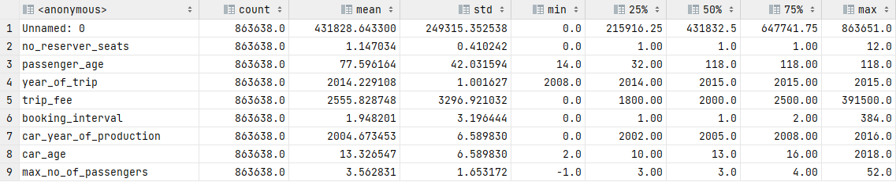

# Analysis of ride-sharing based on Oszkár Telekocsis' database

### Data accessability:
* Data is not uploaded into this repository, and can only be accessed from Oszkár Telekocsi, Hungarys' biggest ride-sharing company.

## Project task flow
### 1. Data preprocessing and cleaning
In this section, I am preparing the data for exporatory data analysis, as well as to serve as an input for machine learning.
1. **preprocessor-v02**:
   * location: ``scripts\preprocessor-v02.ipynb && preprocessor-v02.py``
   * tasks: 
     * renaming columns from Hungarian to English,
     * setting datatypes to match with data
     * errors: ```driver_registration_date``` attribute is missing 31,609 entries, and therefore cannot be set to ```dtype == datetime```

2. **analysis-v01**
   * location: ``scripts\analysis-v01.ipynb && analysis-v01.py``
   * descriptive statistics of the preprocessed dataframe: ``results\descriptive-statistics-preprocessed-v02.csv``
